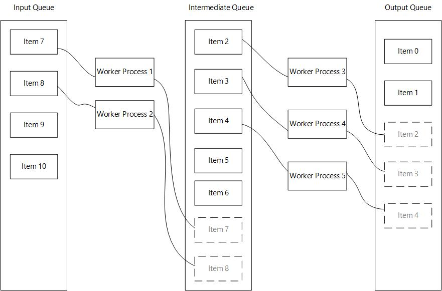

# QueueAutomator

A Python library that wraps the multiprocessing package. It provides a simple to use API to build queue-based multiprocessing pipelines.

## instalation

Run `pip install queue-automator` (use python >=3.6 )

## Summary

QueueAutomator provides a clean decorator API to get started with multiprocessing and queues.

- This library offers an easy interface to parallelize consecutive tasks that take a long time to finish.

- As it is build on top of the native python-multiprocessing library, you can run compute intensive tasks without locking the main process

- All the code that manages queues, spawning and joining processes is already implemented, so you can focus on the task at hand.

How it works:



### Example

#### Using only 1 worker function

```python
from queue_automator import QueueAutomator
from time import sleep

# Create an instance of QueueAutomator()
automator = QueueAutomator()

# Register a worker function (if input_queue_name and output_queue_name are not provided
# they will default to 'input' and 'output' respectively). 'input' and 'output'
# are necessary  to mark the start and ending of your pipeline

@automator.register_as_worker_function(process_count=2)
def do_work(item: int) -> int:
    sleep(2)
    result = item*2
    print(f'{item} times two {result}')
    return result

if __name__ == '__main__':
    input_data = range(30)

    # Always set your input data before calling .run()
    automator.set_input_data(input_data)
    results = automator.run()
    print(results)

```

#### Using more than 1 worker function

```python
from queue_automator import QueueAutomator
from time import sleep

automator = QueueAutomator()

@automator.register_as_worker_function(output_queue_name='square_queue', process_count=2)
def do_work(item: int) -> int:
    sleep(2)
    result = item*2
    print(f'{item} times two {result}')
    return result

@automator.register_as_worker_function(input_queue_name='square_queue', output_queue_name='cube_queue', process_count=2)
def do_work_2(item: int) -> int:
    sleep(2)
    result = item**2
    print(f'{item} squared {result}')
    return result

@automator.register_as_worker_function(input_queue_name='cube_queue', process_count=2)
def do_work_3(item: int) -> int:
    sleep(2)
    result = item**3
    print(f'{item} cubed {result}')
    return result

# Note that the first and last functions in the pipeline do not need to
# declare the input and output queue names respectively.

if __name__ == '__main__':
    input_data = range(30)

    # Always set your input data before calling .run()
    automator.set_input_data(input_data)
    results = automator.run()
    print(results)

```

## Cautions

As with anything, this is not a silver bullet that gets rid of all problems using python multiprocessing

There are some caveats when using this library:

- Launching processes in python is an expensive operation, as it spawns a separate instance of the interpreter. The performance gains could be offset by the time it takes to spawn a process

- Try to keep the number of processes in line with your CPU cores, spawning a ton of them could result in slower performance overall.

- The input objects of every worker function need to be serializable or pickable. This is a limitation of python multiprocessing. If you are dealing with complex objects try to convert them to a suitable format before processing, or implement the `__reduce__`, `__repr__` or `__dict__` methods in your classes.

- It is important that you try to keep your worker functions pure, which means that they should not have side effects.

- The `.run()` method should be called from your main entry point or a function that is called at your main entry point, (this is another limitation of python's multiprocessing)

- Try to optimize the number of process depending of how long a task takes, prioritize longer running tasks.
